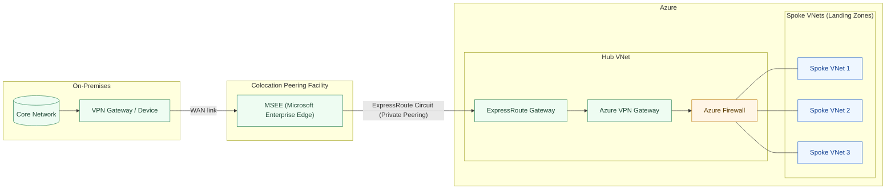

# Hybrid Azure Hub-Spoke Network (ExpressRoute + VPN overlay)

Notes:
- Single ExpressRoute circuit runs from MSEE at the colocation peering facility to the Azure ExpressRoute Gateway; the on‑prem to colo segment is a WAN link.
- A VPN overlay runs end‑to‑end (WAN link + ExpressRoute) between the on‑prem VPN device and the Azure VPN Gateway; traffic flows ER GW → VPN GW → Azure Firewall within the Hub VNet.
 - Three spokes connect directly to the Azure Firewall via VNet peering to the Hub VNet (using UDRs associated with subnets).
